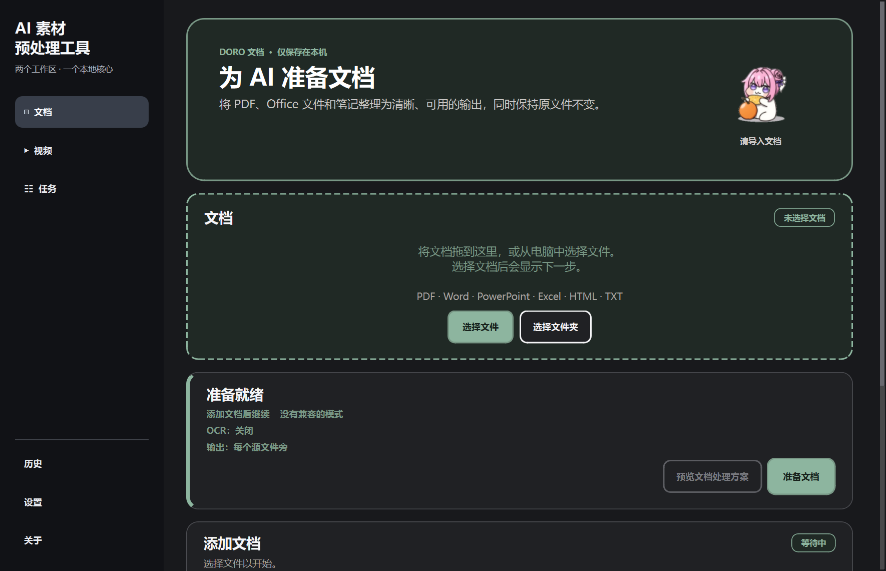
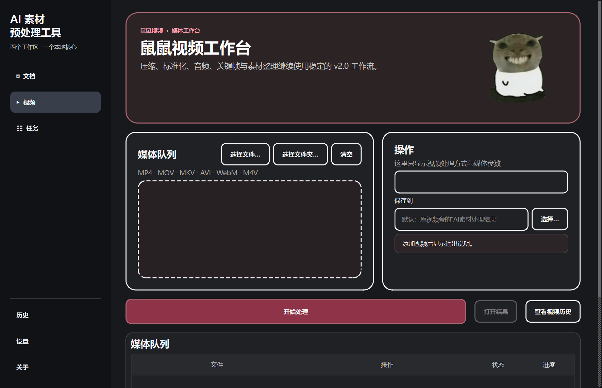

<div align="center">

# AI Material Preprocessor

### 本地整理文档与视频，生成 AI 更容易使用的素材

[English](README.en.md) · **简体中文**

[](https://github.com/Prad1se/ai-material-preprocessor/actions/workflows/tests.yml)
[](https://github.com/Prad1se/ai-material-preprocessor/releases/latest)
[](https://github.com/Prad1se/ai-material-preprocessor/releases/latest)
[](pyproject.toml)
[](LICENSE)

**[下载稳定版](https://github.com/Prad1se/ai-material-preprocessor/releases/latest)** · **[查看示例](examples/)** · **[问题反馈](https://github.com/Prad1se/ai-material-preprocessor/issues)**

</div>

AI Material Preprocessor 是一个面向 Windows 的本地桌面应用。它把 PDF、Word、PowerPoint、Excel、网页、文本和视频素材，整理成结构清晰、可追溯、便于 AI 或后续创作使用的结果。

- **Doro 文档工作区**：转换、清洗、OCR、分块、来源追踪、AI Context Pack 与 Context Budget。
- **鼠鼠视频工作区**：压缩、标准化、音频提取、元数据命名、去重、素材整理和关键帧联系表。
- **本地优先**：默认不上传文件，不覆盖、移动或删除原始素材。

> **版本说明**：最新正式稳定版为 **v2.0.0**；仓库当前代码处于 **v2.1 开发阶段**，包含尚未发布的双工作区、AI Context Pack 与 Source Map 体验。需要稳定安装包的用户请使用 Releases 页面。

<!-- release-version: 2.0.0 -->

## 两个工作区

| Doro 文档 | 鼠鼠视频 |
|---|---|
| 面向阅读、知识整理和 AI 上下文准备 | 面向视频素材批处理和媒体整理 |
| PDF、DOCX、PPTX、XLSX、HTML、TXT 等 | MP4、MOV、MKV、AVI、WebM 等 |
| Markdown、AI-ready 文档包、AI Context Pack | 压缩视频、标准 MP4、音频、关键帧包 |
| 来源标签、质量提醒、Source Map | 元数据、地点命名、重复检测、联系表 |

两个工作区共享同一个任务中心、历史记录、设置和本地执行 Core。切换工作区不会取消正在运行的任务。

<table>
  <tr>
    <td width="50%"><strong>Doro 文档工作区</strong></td>
    <td width="50%"><strong>鼠鼠视频工作区</strong></td>
  </tr>
  <tr>
    <td></td>
    <td></td>
  </tr>
</table>

## 30 秒上手

1. 从 [Releases](https://github.com/Prad1se/ai-material-preprocessor/releases/latest) 下载安装版或便携版。
2. 打开 **文档** 或 **视频** 工作区，拖入素材，也可以使用“选择文件”。
3. 选择处理方式并检查当前任务选项。
4. 点击 **准备文档** 或对应的视频处理按钮。
5. 在结果页打开输出；AI Context Pack 还可使用 **复制给 AI** 和 **查看来源地图**。

仓库中的 [examples/](examples/) 提供合成输入和真实管线生成的 Context Pack 示例，不包含私人资料：

- [研究论文示例](examples/research-paper/)：PDF 页级来源信息。
- [课程资料示例](examples/course-material/)：DOCX 文档级降级定位，不伪造页码。

## 文档能力

### 转换与清洗

- 支持 PDF、DOCX、PPTX、XLSX、HTML、CSV、JSON、XML、TXT、EPUB 等格式转 Markdown。
- 清理重复页眉页脚和 PowerPoint 模板文字，修复标题层级，统一代码围栏与公式标记。
- 保留表格、代码块、块公式、幻灯片与工作表边界。
- 可选本地 OCR；OCR 结果作为补充文本，不覆盖原始提取内容。
- Word / PowerPoint 可转换为 PDF，优先使用 Microsoft Office，并支持 LibreOffice 回退。

### AI Context Pack（v2.1 开发版）

AI Context Pack 不是简单重命名的 Markdown 包。它可以把多份文档组合成一个确定性、可检查的 AI 上下文包：

- 32K、64K、128K、自定义或不限量的 **Context Budget**。
- 按文档、章节、段落等安全边界分包，不为满足预算静默删除内容。
- 稳定的 `source-001` 与 block ID，保留真实可用的页、幻灯片、工作表或文档级来源信息。
- `context-report.json` 记录 estimated tokens、完整性、分包与溢出警告。
- **复制给 AI** 生成确定性的文本，不总结、不改写、不包含绝对路径或二进制素材。
- **Source Map v1** 可从 pack 内容查看对应来源；只能在证据充分时提供页级定位，否则明确降级为打开原文件。

典型输出：

```text
AI-Context-Pack\
├── START_HERE.md              # 使用顺序、预算与警告
├── content.md                 # 完整合并内容归档，不承诺满足单包预算
├── manifest.json              # Context Pack v1 清单
├── context-report.json        # 预算、分包与完整性报告
├── packs\
│   ├── 001-context.md         # 按预算使用的 AI 上传单元
│   └── 002-context.md
└── sources\
    └── source-001\
        ├── content.md
        └── source-manifest.json
```

界面中的 token 数均为 **Estimated tokens（模型无关估算）**，不是 ChatGPT、Claude 或其他模型 tokenizer 的精确计数。

## 视频能力

- 视频压缩：高质量、均衡、体积优先三档。
- 标准化 MP4 与 MP3 / WAV 音频提取。
- 根据拍摄时间、地点、设备等元数据生成可读名称；GPS 地点映射在本机完成。
- 使用 SHA-256、时长与分辨率辅助检测重复素材。
- 按年、日期或地点创建整理副本，不移动或改名原视频。
- 按场景变化提取关键帧并生成带文件名与时间戳的 JPEG 联系表。

## 任务、历史与可靠性

- 批量处理并隔离单个文件失败。
- 任务支持等待、运行、成功、失败、取消、中断和重试；异常退出后可恢复队列状态。
- 处理前进行保守的磁盘空间检查。
- 历史记录支持搜索、筛选与清理，默认保留 90 天 / 512 MB，不保存文档正文。
- 同名输出自动追加 `_2`、`_3`，避免覆盖已有结果。

## 隐私与安全

- 转换、清洗、OCR、媒体处理和历史记录默认全部在本机完成。
- 原始文件不会被覆盖、删除、移动或就地重命名。
- 更新检查默认关闭；启用后仅在用户触发时访问 GitHub Releases API。
- 补充缺失工具前会显示来源、版本、许可证和目标位置；Microsoft Office 不会由应用下载。
- 导出内容可能包含源文件名和文档正文；分享前请自行检查。

## 安装

### Windows 安装包或便携版

前往 [GitHub Releases](https://github.com/Prad1se/ai-material-preprocessor/releases/latest)：

- **Installer EXE**：当前用户安装，提供卸载入口。
- **Portable ZIP**：完整解压后运行 `AI-Material-Preprocessor.exe`，请保留 `_internal`、`tools` 与许可目录。

系统要求为 Windows x64。当前正式版没有商业代码签名，Windows SmartScreen 可能显示“未知发布者”；请先核对 Release 中的 SHA-256。

### 从源码运行

```powershell
git clone https://github.com/Prad1se/ai-material-preprocessor.git
cd ai-material-preprocessor
powershell.exe -NoProfile -ExecutionPolicy Bypass -File .\run.ps1
```

## 开发与贡献

技术栈：Python 3.11+、PySide6 Widgets、MarkItDown、FFmpeg、RapidOCR、ONNX Runtime、PyInstaller。

```powershell
# 完整质量门：格式、静态检查、类型与测试
powershell.exe -NoProfile -ExecutionPolicy Bypass -File .\scripts\check_quality.ps1

# 构建与验证正式包
powershell.exe -NoProfile -ExecutionPolicy Bypass -File .\scripts\build_release.ps1
powershell.exe -NoProfile -ExecutionPolicy Bypass -File .\scripts\package_release.ps1
powershell.exe -NoProfile -ExecutionPolicy Bypass -File .\scripts\verify_release.ps1 -Version 2.0.0
```

- [贡献指南](CONTRIBUTING.md)
- [安全报告](SECURITY.md)
- [故障排查](docs/TROUBLESHOOTING.md)
- [架构决策](docs/adr/)
- [v2.0 基线](docs/BASELINE_2.0.md)
- [发布说明](docs/releases/)

## 许可证与素材

项目自写源代码采用 [MIT License](LICENSE)。MarkItDown、PySide6、RapidOCR、ONNX Runtime、pypdfium2、FFmpeg 等第三方组件遵循各自许可证，详见 [THIRD_PARTY_NOTICES.md](THIRD_PARTY_NOTICES.md) 与 `third_party_licenses/`。

> Doro 与鼠鼠图片不是 MIT 代码许可证的一部分。Doro 素材按项目维护者确认的非商业使用条件随应用提供；商业分发应移除、替换或另行取得许可。具体来源、用途与替换方式见 [Doro 素材说明](assets/doro/README.md) 和 [鼠鼠素材说明](assets/mouse/README.md)。该说明不代表项目拥有相关角色或原始作品权利。
